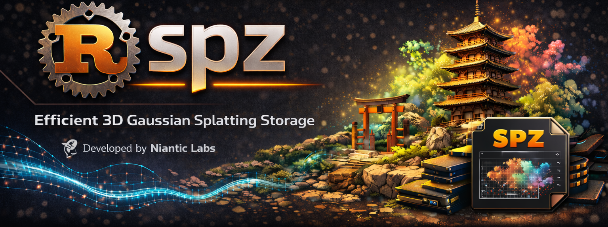

<p align="center">
	
</p>

<h1 align="center">SPZ<span></span></h1>

<div align="center"><b>Rust</b> and <b>Python</b> implementation of the <b>.SPZ</b> file format (v3) and <b>CLI</b> tools.</div>
&nbsp;
<div align="center"><b>WIP</b></div>
&nbsp;
<p align="center">
	<a href="https://crates.io/crates/spz" target="_blank">
		
	</a>
	<a href="https://docs.rs/spz" target="_blank">
		
	</a>
	<a href="https://lib.rs/crates/spz" target="_blank">
		
	</a>
	<a href="https://github.com/Jackneill/spz/tags" target="_blank">
		
	</a>
	<br>
	<a href="https://github.com/Jackneill/spz/actions" target="_blank">
		
	</a>
	<a href="https://deps.rs/repo/github/Jackneill/spz" target="_blank">
		
	</a>
	<a href="https://github.com/Jackneill/spz/commits/main/" target="_blank">
		
	</a>
	<br>
	<a href="https://codspeed.io/Jackneill/spz" target="_blank">
		
	</a>
	<a href="https://codecov.io/github/Jackneill/spz" target="_blank">
		
	</a>
	<a href="https://app.codacy.com/gh/Jackneill/spz/dashboard?utm_source=gh&utm_medium=referral&utm_content=&utm_campaign=Badge_grade" target="_blank">
		
	</a>
	<br>
	<a href="./LICENSE-MIT" target="_blank">
		
	</a>
	<a href="https://app.fossa.com/projects/git%2Bgithub.com%2FJackneill%2Fspz?ref=badge_shield&issueType=license" alt="FOSSA Status" target="_blank">
		
	</a>
	<a href="https://app.fossa.com/projects/git%2Bgithub.com%2FJackneill%2Fspz?ref=badge_shield&issueType=security" alt="FOSSA Status" target="_blank">
		
	</a>
	<br>
	<a href="https://github.com/Jackneill/spz" target="_blank">
		
	</a>
	<a href="https://pypi.org/project/spz/" target="_blank">
		
	</a>
	<hr>
	<br>
	<a href="https://flathub.org/apps/io.github.jackneill.spz" target="_blank">
		
	</a>
	<a href="https://snapcraft.io/spz" target="_blank">
		
	</a>

</p>

## What is SPZ?

SPZ is a compressed file format for 3D Gaussian Splats, designed by Niantic.
It provides efficient storage of Gaussian Splat data with configurable
spherical harmonics degrees and coordinate system support.

See [docs/SPZ_SPEC_v3.md](docs/SPZ_SPEC_v3.md) for more information.

## CLI

```sh
$ # install:
$ cargo install spz
$ # or
$ flatpak install io.github.jackneill.spz
$ # or
$ snap install spz
$
$ # run:
$ spz info assets/racoonfamily.spz
$ # or in container:
$ podman/docker run --rm -it -v "${PWD}:/app" -w /app spz \
$	info assets/racoonfamily.spz
GaussianSplat:
	Number of points:		932560
	Spherical harmonics degree:	3
	Antialiased:			true
	Median ellipsoid volume:	0.0000000046213082
	Bounding box:
		x: -281.779541 to 258.382568 (size 540.162109, center -11.698486)
		y: -240.000000 to 240.000000 (size 480.000000, center 0.000000)
		z: -240.000000 to 240.000000 (size 480.000000, center 0.000000)
```

## Development

<a href="https://codespaces.new/Jackneill/spz?quickstart=1" target="_blank">
	</img>
</a>

## Rust

## Usage

```toml
[dependencies]
spz = { version = "0.0.7", default-features = false, features = [] }
```

```rust
use spz::prelude::*;
```

## Examples

```sh
cargo run --example load_spz
```

## Quick Start

```rust
// SPDX-License-Identifier: Apache-2.0 OR MIT

use std::path::PathBuf;

use anyhow::Result;
use spz::{
	coord::CoordinateSystem,
	gaussian_splat::GaussianSplat,
	gaussian_splat::{LoadOptions, SaveOptions},
	packed::PackedSpz,
};

fn main() -> Result<()> {
	let mut sample_spz = PathBuf::from(env!("CARGO_MANIFEST_DIR"));
	sample_spz.push("assets/racoonfamily.spz");

	let gs = GaussianSplat::load(sample_spz.clone())?;

	let gs_cs = GaussianSplat::load_with(
		sample_spz,
		&LoadOptions::builder()
			.coord_sys(CoordinateSystem::LeftUpFront)
			.build(),
	)?;
	Ok(())
}
```

## API

### Outline Overview

* This outline is _non-exhaustive_.

```rust
// SPDX-License-Identifier: Apache-2.0 OR MIT

// mod gaussian_splat ──────────────────────────────────────────────────────────

pub struct GaussianSplatBuilder { /* ... */ }

impl GaussianSplatBuilder {
	pub fn packed(self, packed: bool) -> Result<Self>;
	pub fn load_options(self, opts: LoadOptions) -> Self;

	pub fn load<P: AsRef<Path>>(self, filepath: P) -> Result<GaussianSplat>;
	pub async fn load_async<P: AsRef<Path>>(self, filepath: P) -> Result<GaussianSplat>;
}

#[derive(Clone, Debug, Default, PartialEq, Serialize, Deserialize, Arbitrary)]
pub struct GaussianSplat {
	pub header: Header,

	pub positions: Vec<f32>,	// flattened: [x0, y0, z0, x1, y1, z1, ...]
	pub scales: Vec<f32>,		// flattened: [x0, y0, z0, x1, y1, z1, ...], log-scale
	pub rotations: Vec<f32>,	// flattened: [x0, y0, z0, w0, x1, y1, z1, w1, ...]
	pub alphas: Vec<f32>,		// opacity (sigmoid-encoded)
	pub colors: Vec<f32>,		// flattened: [r0, g0, b0, r1, g1, b1, ...], DC color
	pub spherical_harmonics: Vec<f32>, // SH coefficients (degrees 1-3)
}

impl GaussianSplat {
	// Construction & Loading
	pub fn builder() -> GaussianSplatBuilder;
	pub fn load_packed_from_file<F: AsRef<Path>>(filepath: F, opts: &UnpackOptions) -> Result<Self>;
	pub fn load_packed<D: AsRef<[u8]>>(data: D) -> Result<PackedGaussians>;
	pub fn new_from_packed_gaussians(packed: &PackedGaussians, opts: &UnpackOptions) -> Result<Self>;

	// Serialization
	pub fn save_as_packed<F: AsRef<Path>>(&self, filepath: F, opts: &PackOptions) -> Result<()>;
	pub fn serialize_as_packed_bytes(&self, opts: &PackOptions) -> Result<Vec<u8>>;
	pub fn to_packed_gaussians(&self, opts: &PackOptions) -> Result<PackedGaussians>;

	// Transforms
	pub fn convert_coordinates(&mut self, from: CoordinateSystem, to: CoordinateSystem);

	// Introspection
	pub fn bbox(&self) -> BoundingBox;
	/// Compute median ellipsoid volume.
	pub fn median_volume(&self) -> f32;
	/// Validates that all internal arrays have consistent sizes.
	pub fn check_sizes(&self) -> bool;
}

pub struct LoadOptions {
	pub coord_sys: CoordinateSystem,
}

impl LoadOptions {
	pub fn builder() -> LoadOptionsBuilder;
}

pub struct LoadOptionsBuilder {
	coord_sys: CoordinateSystem,
}

impl LoadOptionsBuilder {
	pub fn coord_sys(mut self, coord_sys: CoordinateSystem) -> Self;
	pub fn build(self) -> LoadOptions;
}

pub struct SaveOptions {
	pub coord_sys: CoordinateSystem,
}

impl SaveOptions {
	pub fn builder() -> SaveOptionsBuilder;
}

pub struct SaveOptionsBuilder {
	coord_sys: CoordinateSystem,
}

impl SaveOptionsBuilder {
	pub fn coord_sys(mut self, coord_sys: CoordinateSystem) -> Self;
	pub fn build(self) -> SaveOptions;
}

pub struct BoundingBox {
	pub x_min: f32, pub x_max: f32,
	pub y_min: f32, pub y_max: f32,
	pub z_min: f32, pub z_max: f32,
}

impl BoundingBox {
	pub fn size(&self) -> (f32, f32, f32);	 // (width, height, depth)
	pub fn center(&self) -> (f32, f32, f32); // (x, y, z)
}

// mod coord ───────────────────────────────────────────────────────────────────

pub enum CoordinateSystem {
	Unspecified = 0,

	/* LDB */ LeftDownBack = 1,
	/* RDB */ RightDownBack = 2,
	/* LUB */ LeftUpBack = 3,
	/* RUB */ RightUpBack = 4,	// SPZ Internal, Three.js coordinate system
	/* LDF */ LeftDownFront = 5,
	/* RDF */ RightDownFront = 6, 	// PLY coordinate system
	/* LUF */ LeftUpFront = 7,	// GLB coordinate system
	/* RUF */ RightUpFront = 8,	// Unity coordinate system
}

impl CoordinateSystem {
	/// Returns a short 3-letter abbreviation for the coordinate system.
	pub fn as_short_str(&self) -> &'static str;
	/// Returns an iterator over all coordinate system variants.
	pub fn iter() -> impl Iterator<Item = CoordinateSystem>;
}

// mod header ──────────────────────────────────────────────────────────────────

/// Fixed-size 16-byte header for SPZ (packed Gaussian splat) files.
#[repr(C)]
pub struct Header {
	pub magic: i32,				// 0x5053474e "NGSP"
	pub version: i32,			// 2 or 3
	pub num_points: i32,
	pub spherical_harmonics_degree: u8,	// 0-3
	pub fractional_bits: u8,
	// Currently there is only 1 flag: 0x1 = antialiased
	pub flags: u8,
	pub reserved: u8,			// Must be `0`.
}

impl Header {
	/// DOES NOT validate whether the read header is a valid SPZ header,
	/// simply reads the bytes and interprets them as a header.
	pub fn from_file_unchecked<P>(filepath: P) -> Result<Self>;
	pub fn from_file<P>(filepath: P) -> Result<Self>;
	/// Reads a header from the given reader.
	pub fn read_from<R: Read>(reader: &mut R) -> Result<Self>;
	/// Writes this header to the given writer.
	pub fn serialize_to<W: Write>(&self, writer: &mut W) -> Result<()>;
	/// Does some basic validation of this header.
	pub fn is_valid(&self) -> bool;
}
```

## Tests

### Pre-Requisites

* [Install `nextest` runner](https://nexte.st/docs/installation/pre-built-binaries/).
* For fuzz testing: `cargo install cargo-fuzz`
 	* Further documentation is available in [fuzz/README.md](./fuzz/README.md).
* [Install cargo-mutants](https://mutants.rs/getting-started.html) for test insights.
 	* `cargo install cargo-mutants`

### Run

```sh
just test
just fuzz
just mutants
```

## Benches

### Pre-Requisites

* `cargo install cargo-criterion`
* Install `gnuplot` for html reports.

### Run

```sh
just bench
```

* The html report of the benchmark can be found under `./target/criterion/report/index.html`.
* View Benchmark and Profiling data on [CodSpeed](https://codspeed.io/Jackneill/spz), (from CI runs).

## Test Code Coverage

<a href="https://codecov.io/github/Jackneill/spz">
	
</a>

## Build

### Pre-Requisites

* Install the `mold` linker: <https://github.com/rui314/mold>

## Python

## Usage

```sh
uvx pip install spz
```

```toml
# pyproject.toml

[project]
dependencies = [
    "spz",
]
```

## Examples

```py
import numpy as np
import spz

# Load from file
splat = spz.load("scene.spz")  # -> GaussianSplat
# or
splat = spz.GaussianSplat.load(
    "scene.spz", coordinate_system=spz.CoordinateSystem.RUB
)  # -> GaussianSplat
# or
with spz.SplatReader("scene.spz") as ctx:
    splat2 = ctx.splat  # -> GaussianSplat

with spz.temp_save(splat) as tmp_path:
    import subprocess

    subprocess.run(["viewer", str(tmp_path)])

# Access properties
print(f"{splat.num_points:,} points")
print(f"center: {splat.bbox.center}")
print(f"size: {splat.bbox.size}")

# Access data as numpy arrays
positions = splat.positions  # shape: (num_points, 3)
scales = splat.scales  # shape: (num_points, 3)
rotations = splat.rotations  # shape: (num_points, 4)
alphas = splat.alphas  # shape: (num_points,)
colors = splat.colors  # shape: (num_points, 3)
sh = splat.spherical_harmonics  # shape: (num_points, sh_dim * 3)

# Serialize
data = splat.to_bytes()  # -> bytes
splat2 = spz.GaussianSplat.from_bytes(data)  # -> GaussianSplat

# Create from numpy arrays
new_splat = spz.GaussianSplat(
    positions=np.zeros((2, 3), dtype=np.float32),
    scales=np.full((2, 3), -5.0, dtype=np.float32),
    rotations=np.tile([1.0, 0.0, 0.0, 0.0], (2, 1)).astype(np.float32),
    alphas=np.array([0.5, 0.8], dtype=np.float32),
    colors=np.array([[255.0, 0.0, 0.0], [0.0, 255.0, 0.0]], dtype=np.float32),
)  # -> GaussianSplat

# Save to file
new_splat.save("output.spz")

with spz.SplatWriter("output2.spz") as writer:
    writer.splat = splat2

# Coordinate conversion
with spz.modified_splat("scene.spz", "scene_converted.spz") as splat:
    splat.convert_coordinates(spz.CoordinateSystem.RUB, spz.CoordinateSystem.RDF)
```

## C Bindings

* Documentation for the C bindings can be found in [`./crates/spz-capi/README.md`](./crates/spz-capi/README.md).

## Documentation

Further documentation is available under `./docs`.

### Overview

An `SPZ` file consists of:

1. **Outer compression**:
	The entire payload is gzip-compressed.
2. **Inner binary data**:
	A header followed by non-interleaved arrays of gaussian attributes.

#### File Structure

```
┌─────────────────────────────────────────┐
│           GZIP Compressed Data          │
│  ┌───────────────────────────────────┐  │
│  │         Header (16 bytes)         │  │
│  ├───────────────────────────────────┤  │
│  │         Positions Array           │  │
│  ├───────────────────────────────────┤  │
│  │          Alphas Array             │  │
│  ├───────────────────────────────────┤  │
│  │          Colors Array             │  │
│  ├───────────────────────────────────┤  │
│  │          Scales Array             │  │
│  ├───────────────────────────────────┤  │
│  │         Rotations Array           │  │
│  ├───────────────────────────────────┤  │
│  │    Spherical Harmonics Array      │  │
│  └───────────────────────────────────┘  │
└─────────────────────────────────────────┘
```

* The data is organized by attribute (Structure of Arrays),
 	* rather than by gaussian (Array of Structures) for better compression ratios.

## License

Licensed under either of

* Apache License, Version 2.0 ([LICENSE-APACHE](LICENSE-APACHE) or <http://www.apache.org/licenses/LICENSE-2.0>)
 	* `SPDX-License-Identifier: Apache-2.0`
* MIT license ([LICENSE-MIT](LICENSE-MIT) or <http://opensource.org/licenses/MIT>)
at your option.
 	* `SPDX-License-Identifier: MIT`

## Contribution

Unless you explicitly state otherwise, any contribution intentionally submitted
for inclusion in the work by you, as defined in the _Apache-2.0_ license, shall
be dual licensed as above, without any additional terms or conditions.

<a href="https://app.fossa.com/projects/git%2Bgithub.com%2FJackneill%2Fspz?ref=badge_large&issueType=license" alt="FOSSA Status">
	
</a>
